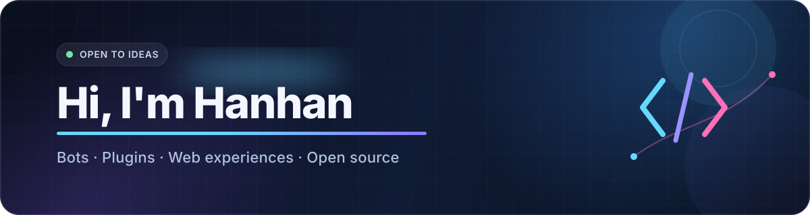

  

  
  
  

 

## 关于我

你好，我是 **憨憨（Hanhan）**。我喜欢把脑海里的小想法做成真正能用的东西，最近主要在折腾机器人生态、插件开发和个人 Web 应用。

- 🧩 在 **Karin / 云崽** 生态里开发和维护机器人插件
- 🌱 使用 **TypeScript、JavaScript 与 Vue** 构建有趣、实用的小项目
- 🛠️ 关注简单部署、长期稳定和舒服的使用体验
- 💬 欢迎讨论插件开发、自动化，或任何值得动手实现的点子

## 精选项目

<table>
  <tr>
    <td width="50%" valign="top">
      <h3><a href="https://github.com/hanhan258/hanhan-plugin">🧩 hanhan-plugin</a></h3>
      
面向云崽的多功能插件，在实际使用中持续维护与迭代。

      

        
        
      

    </td>
    <td width="50%" valign="top">
      <h3><a href="https://github.com/hanhan258/karin-plugin-levi">⚡ karin-plugin-levi</a></h3>
      
为 Karin 机器人框架打造的插件集合，支持 Kritor 生态。

      

        
        
      

    </td>
  </tr>
  <tr>
    <td width="50%" valign="top">
      <h3><a href="https://github.com/hanhan258/HanSpace">🌌 HanSpace</a></h3>
      
一个记录心里话、日记、照片与生活片段的私密个人空间。

      

        
        
      

    </td>
    <td width="50%" valign="top">
      <h3><a href="https://github.com/hanhan258/bing-daily">🖼️ bing-daily</a></h3>
      
通过 GitHub Actions 每天自动抓取并保存 Bing 每日壁纸。

      

        
        
      

    </td>
  </tr>
</table>

## 技术与工具

  

## GitHub 数据

  
  

## 贡献轨迹

<picture>
  <source media="(prefers-color-scheme: dark)" srcset="https://raw.githubusercontent.com/hanhan258/hanhan258/output/github-contribution-grid-snake-dark.svg" />
  <source media="(prefers-color-scheme: light)" srcset="https://raw.githubusercontent.com/hanhan258/hanhan258/output/github-contribution-grid-snake.svg" />
  
</picture>

  保持好奇，持续构建。 · Stay curious, keep building.

